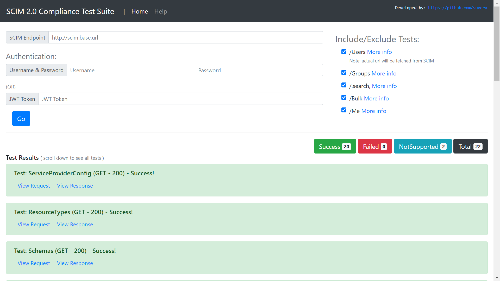

# SCIM 2.0 Compliance Test Utility

scim2-compliance-test-utility


## Installation


```

git clone https://github.com/suvera/scim2-compliance-test-utility.git


cd scim2-compliance-test-utility


mvn clean install


mvn install:install-file -Dfile=dependencies/scim2-client-1.0.1-SNAPSHOT-jar-with-dependencies.jar -DgroupId=org.wso2.scim2 -DartifactId=scim2-client


# Start application on port 8080
java -cp dependencies -jar target/scim2-compliance-test-utility-0.0.1-SNAPSHOT.jar


# Logs
2020-09-09 13:06:12.567  INFO 20316 --- [  restartedMain] o.s.b.w.embedded.tomcat.TomcatWebServer 
 : Tomcat started on port(s): 8080 (http) with context path ''
2020-09-09 13:06:12.578  INFO 20316 --- [  restartedMain] d.s.o.scim2.compliance.Scim2Application  
: Started Scim2Application in 2.735 seconds (JVM running for 3.489)


```


## Screenshots





